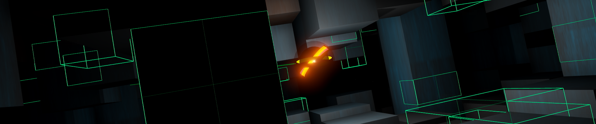

## Unity Explorer Drone (Reinforcement Learning) - [Video](https://www.youtube.com/watch?v=3-4_-FBDr8Q)

This is a basic zero gravity drone demo, made with Unity Machine Learning Agents. The idea was to train a drone which has just a single raycast per timestep for scanning its environment. Each ray intersects an octree and creates leaf nodes along its way. The number of intersections per node and the accumulated leaf node volume near the drone's position are observed for reinforcement learning. As well as the drone's velocity and a buffer containing the 10 most recent scan points. Rewards are set in proportion to the number of newly created leafs. The drone's action space consists of values for propulsion and raycast direction.

Dependencies: [Unity ML-Agents v0.6](https://github.com/Unity-Technologies/ml-agents) and [Unity Tensorflow Plugin](https://github.com/Unity-Technologies/ml-agents/blob/master/docs/Using-TensorFlow-Sharp-in-Unity.md)

The project uses [Popcron's Gizmos library](https://github.com/popcron/gizmos) for data visualization.
